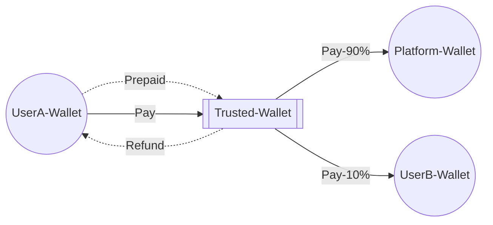

# Web3Pay

Web3 User Pay Service



## Pay Biz

1. /getAccount
   ```
   curl -X 'POST' \
    'http://127.0.0.1:3000/getAccount' \
    -H 'Content-Type: application/json' \
    -d '{
      "address": "5oNDL3swdJJF1g9DzJiZ4ynHXgszjAEpUkxVYejchzrY"
    }'

    {
        "result":"4FHTRksmGQJj4VGsvUewjCfidHqJtNxwhyKkhCdftBrf"
    }
   ```
2. /getBalance
   ```
   curl -X 'POST' \
    'http://127.0.0.1:3000/getBalance' \
    -H 'Content-Type: application/json' \
    -d '{
      "address": "7iCzEsN1xrV9gZoWMvUaWKhAhy1Cqm9iAeVAmJVThCqV"
    }'

    {
        "result":5589950000
    }
   ```
3. /withdraw
   ```
   curl -X 'POST' \
    'http://127.0.0.1:3000/withdraw' \
    -H 'Content-Type: application/json' \
    -d '{
      "address": "7iCzEsN1xrV9gZoWMvUaWKhAhy1Cqm9iAeVAmJVThCqV"
    }'

    {
        "result":"41rAZAP5JAVRbUqGKqbvCYLQob18sgZhVrEaRSxaqGGaW9FtS4oDX9c7Aoyj7yMs8Xw3pkWDtgEmhJ8vAjLk4XHb"
    }
   ```
4. /pay
   ```
   curl -X 'POST' \
    'http://127.0.0.1:3000/withdraw' \
    -H 'Content-Type: application/json' \
    -d '{
      "address": "7iCzEsN1xrV9gZoWMvUaWKhAhy1Cqm9iAeVAmJVThCqV",
      "amount": 5000
    }'

    {
        "result":"41rAZAP5JAVRbUqGKqbvCYLQob18sgZhVrEaRSxaqGGaW9FtS4oDX9c7Aoyj7yMs8Xw3pkWDtgEmhJ8vAjLk4XHb"
    }
   ```
